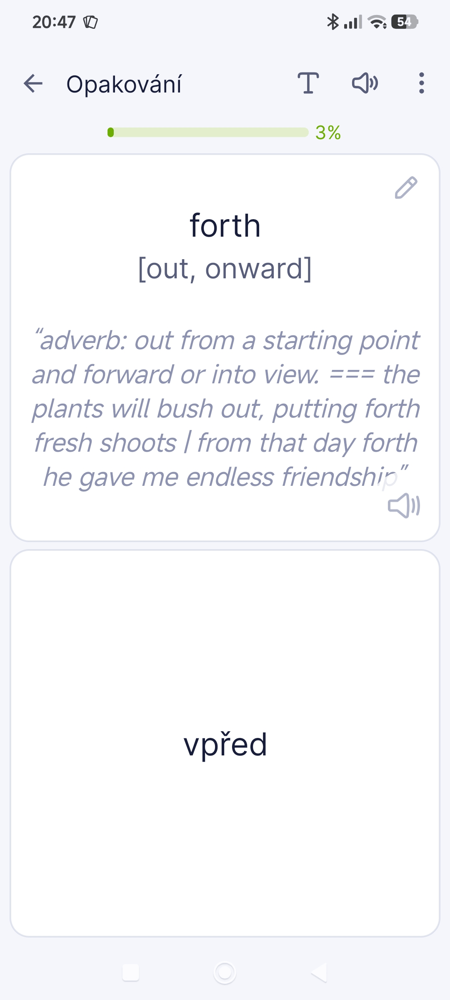

# Google translate favourites to better csv

This simple script takes csv file table exported from Google Translate favourites with structure like this

| source | target | word | translation |
|---|---|---|---|
| angličtina | čeština | quirk | zvláštnost |
| angličtina | čeština | taunt | posměch |
| čeština | angličtina | pohostinnost | hospitality |

And convert it to table like this

| en | čeština | synonyms | definitions_examples |
|---|---|---|---|
| quirk | zvláštnost | hang-up, idiosyncrasy, singularity, chance | noun: a peculiar behavioral habit. \| noun: an acute hollow between convex or other moldings. \| verb: (with reference to a person's mouth or eyebrow) move or twist suddenly, especially to express surprise or amusement. === his distaste for travel is an endearing quirk \| wry humor put a slight quirk in his mouth |
| taunt | posměch | jeer, dig, make sport of, jeer at, rib | noun: a remark made in order to anger, wound, or provoke someone. \| verb: provoke or challenge (someone) with insulting remarks. |
| hospitality | pohostinnost | friendliness | noun: the friendly and generous reception and entertainment of guests, visitors, or strangers. === the hospitality industry \| he said that young people learn valuable skills by taking jobs in hospitality |

It keeps original translation and just add synonyms and delimited definitions === examples.

It uses library googletrans.

Main reason for this is for learning the vocabulary. It can be used for example with app Lexilize Flashcards.

Then it can look like this...

Feel free to contribute...
